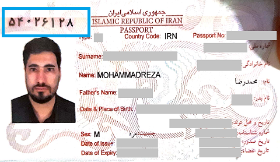
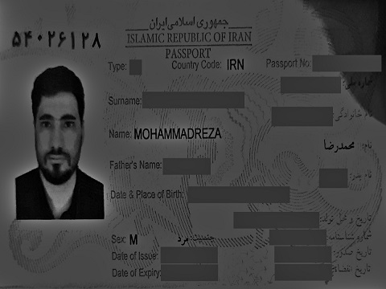
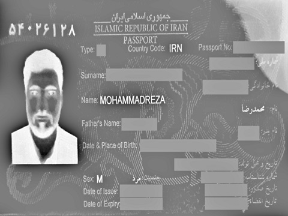
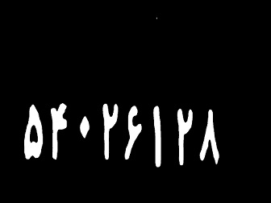
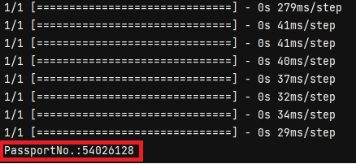

# Passport-Number Reader
Optical Character Recognition/Reader (OCR) is the mechanical conversion of images of typed, handwritten, or printed text into machine-encoded text, whether from a scanned document, a photo of a document, or a scene photo.
In this project, Numerical information on persian passport has been recognized.



## First Step
 The first step after loading the image is to remove heavy shadows.


## second Step
In the second step, we have to apply a threshold on the image.


## Third Step
After applying the threshold on the image, we have to crop the region of interest. 


## Fourth Step
The cropped image is then split into eight sub-images and then feeds the model for prediction.


## Install requirements

```bash
pip install -r .\requirements.txt
```

